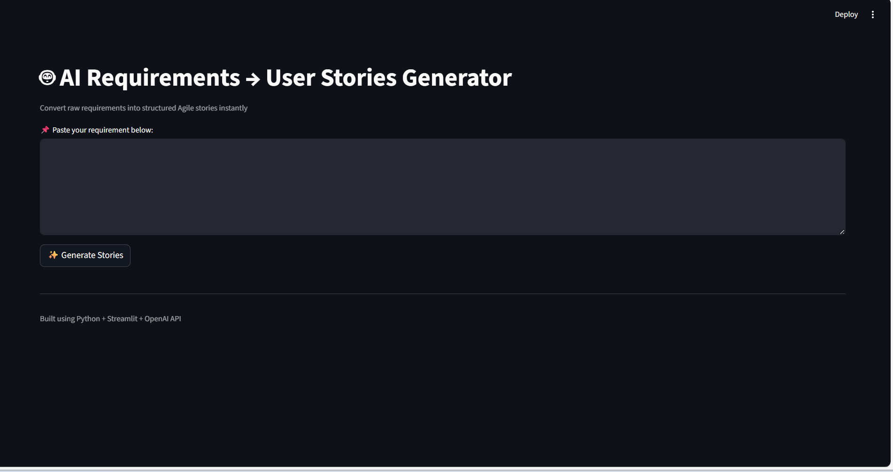
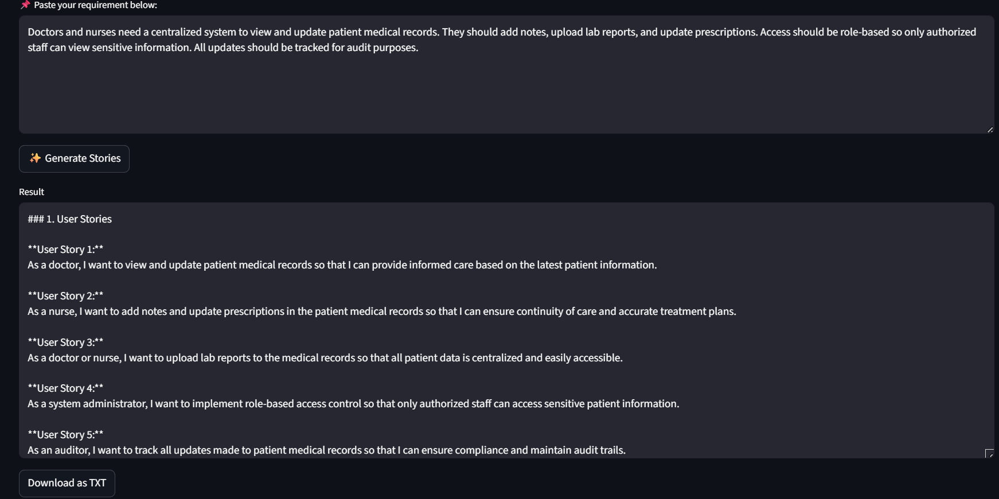

# 🤖 AI Requirements → User Stories Generator

AI-powered web app that converts raw business requirements into structured Agile documentation automatically.

---

## 🚀 Overview
Business Analysts spend hours manually writing:
- User Stories
- Acceptance Criteria
- Edge Cases
- Test Cases

This tool automates the process using AI and generates everything in seconds.

---

## ✨ Features
✅ Generate user stories automatically  
✅ Create acceptance criteria  
✅ Identify edge cases  
✅ Generate test cases  
✅ Download results as TXT  
✅ Modern dark theme UI  
✅ Built with Streamlit + OpenAI  

---

## 🛠 Tech Stack
- Python
- Streamlit
- OpenAI API
- Prompt Engineering

---

## 📸 Screenshots

### App UI


### Generated Output


---

## ▶️ How to Run

```bash
pip install streamlit openai
python -m streamlit run app.py
